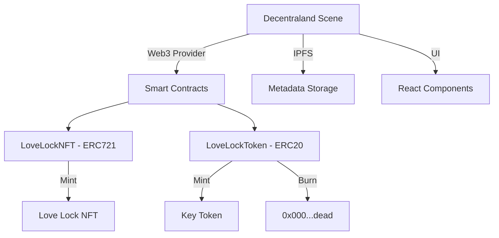

# 💕 LoveLock Bridge - Eternal Love on Blockchain

<div align="center">
  
  
  
  
  
  
  **🏆 Hackathon Submission for [Hackathon Name]**
  
  [Demo Video](https://youtube.com/XXX) | [Live Demo](https://play.decentraland.org/?position=X,X) | [Presentation](https://slides.com/presentation)

</div>

## 🎯 Project Overview

**LoveLock Bridge** brings the romantic tradition of love locks into the metaverse, creating an eternal testament to love on the blockchain. Couples can place virtual love locks on a beautiful bridge in Decentraland, with each lock minted as an NFT on Polygon. When they "throw away the key," the associated ERC20 tokens are burned, sealing their love forever on the immutable blockchain.

### 🌟 Key Features

- **🔒 Dual-Token System**: ERC721 NFT for the lock + ERC20 token for the key
- **💝 Emotional Experience**: Beautiful visual effects, romantic atmosphere
- **📊 On-Chain Statistics**: Real-time display of love metrics
- **♾️ Eternal Commitment**: Burn mechanism makes love permanent
- **🎨 Customization**: Multiple lock styles (Gold, Silver, Rose Gold, Crystal)

## 🚀 Quick Start

### Prerequisites
- Node.js v16+
- MetaMask wallet
- MATIC tokens for gas fees
- Decentraland SDK

### Installation

```bash
# Clone the repository
git clone https://github.com/yourusername/lovelock-bridge.git
cd lovelock-bridge

# Install dependencies
npm install

# Set up environment variables
cp .env.example .env
# Edit .env with your private key and RPC URLs

# Compile smart contracts
npm run compile

# Deploy to Mumbai testnet
npm run deploy:mumbai

# Start Decentraland scene locally
npm run dcl:start
```

## 🏗️ Architecture



## 💻 Tech Stack

| Component | Technology |
|-----------|------------|
| **Blockchain** | Polygon (MATIC) |
| **Smart Contracts** | Solidity 0.8.19 |
| **Token Standards** | ERC721 + ERC20 |
| **Metaverse Platform** | Decentraland SDK 7 |
| **Frontend** | TypeScript, React-ECS |
| **Storage** | IPFS (Pinata) |
| **Development** | Hardhat, Ethers.js |
| **Testing** | Chai, Waffle |

## 📝 Smart Contracts

### LoveLockNFT (ERC721)
- Represents the love lock on the bridge
- Stores couples' names, messages, and dates
- Tracks key status (thrown/not thrown)

### LoveLockToken (ERC20)
- Represents the key to the lock
- 1:1 ratio with NFT (1 token per lock)
- Burned to 0x000...dead when thrown away

**Deployed Contracts (Polygon Mumbai)**
- LoveLockNFT: `0x...` [View on Polygonscan](https://mumbai.polygonscan.com/)
- LoveLockToken: `0x...` [View on Polygonscan](https://mumbai.polygonscan.com/)

## 🎮 User Flow

1. **Connect Wallet** → MetaMask connection
2. **Create Lock** → Input names & message → Mint NFT + Token
3. **Place on Bridge** → Visual representation appears
4. **Throw Key (Optional)** → Burn token → Eternal commitment
5. **View Stats** → See total locks and eternal loves

## 🎨 Unique Features

### Emotional Design Elements
- 🌅 Sunset lighting for romantic atmosphere
- ✨ Particle effects when placing locks
- 💕 Heart animations when throwing keys
- 🎵 Romantic background music
- 🎊 Special effects for milestones

### Gamification
- 🏆 Achievement system for milestones
- 📊 Leaderboard for most romantic couples
- 🎁 Special editions for holidays (Valentine's, Anniversary)
- 🌟 Rare lock designs for special token IDs

## 📊 Impact & Innovation

### Problem Solved
- **Digital Permanence**: Creating lasting digital memories in virtual worlds
- **Emotional Connection**: Bridging traditional romance with Web3
- **Accessibility**: Global access to romantic traditions

### Innovation Points
1. **Dual-token mechanism** for interactive storytelling
2. **Burn-to-commit** model for permanent decisions
3. **Metaverse-blockchain integration** for immersive experience
4. **On-chain emotions** - storing feelings permanently

## 🔮 Future Roadmap

- [ ] **Phase 1** - Launch on Polygon Mainnet
- [ ] **Phase 2** - AR mobile app for real-world viewing
- [ ] **Phase 3** - Cross-metaverse compatibility
- [ ] **Phase 4** - Virtual wedding ceremonies
- [ ] **Phase 5** - Anniversary reminders & rewards

## 👥 Team

| Role | Name | GitHub | LinkedIn |
|------|------|--------|----------|
| **Lead AI-supported Developer** | Yudai | [@github](https://github.com) 
| **Product Manager** | Yuki | [@github](https://github.com) 

## 🏆 Hackathon Criteria

### ✅ Technical Implementation
- Fully functional smart contracts deployed on testnet
- Interactive Decentraland scene
- Web3 integration with MetaMask
- IPFS metadata storage

### ✅ Innovation
- Novel dual-token system
- Permanent commitment mechanism
- Emotional blockchain use case

### ✅ User Experience
- Intuitive UI/UX
- Beautiful visual effects
- Emotional storytelling

### ✅ Business Potential
- Clear monetization model (fees on special editions)
- Partnership opportunities (wedding planners, dating apps)
- Scalable to other metaverses

## 📹 Demo & Resources

- 🎥 **[Demo Video](https://youtube.com/demo)** - 3-minute walkthrough
- 🎮 **[Live Scene](https://play.decentraland.org/?position=0,0)** - Try it yourself!
- 📊 **[Presentation Slides](https://slides.com/presentation)** - Pitch deck
- 📝 **[Technical Documentation](./TECHNICAL.md)** - Deep dive
- 🖼️ **[Screenshots](./screenshots)** - Visual gallery

## 📄 License

MIT License - see [LICENSE](./LICENSE) file

## 🤝 Contributing

We welcome contributions! Please see our [Contributing Guidelines](./CONTRIBUTING.md)

---

<div align="center">
  
  **Built with ❤️ for LoveLock Bridge 2025**
  
  *Love is forever, especially on the blockchain*
  
</div>
