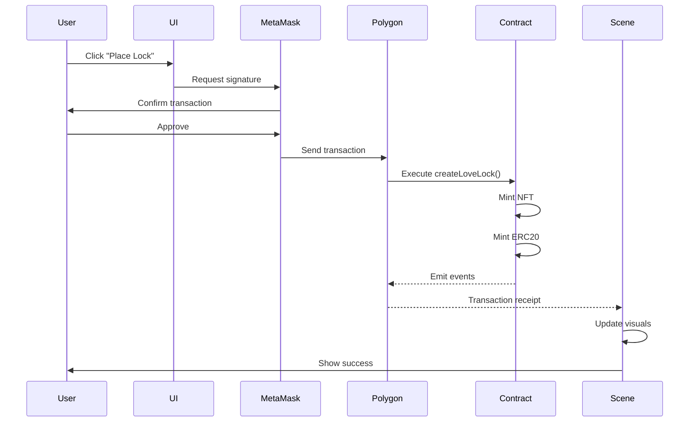

# 🔧 Technical Documentation - LoveLock Bridge

## Architecture Overview

### System Components

```
┌─────────────────────────────────────────────────────────┐
│                    Decentraland Client                   │
│  ┌─────────────┐  ┌──────────────┐  ┌──────────────┐  │
│  │   3D Scene  │  │   UI Layer   │  │  Web3 Module │  │
│  └─────────────┘  └──────────────┘  └──────────────┘  │
└─────────────────────────────────────────────────────────┘
                              │
                    ┌─────────┴─────────┐
                    │    MetaMask       │
                    └─────────┬─────────┘
                              │
        ┌─────────────────────┴─────────────────────┐
        │            Polygon Network                 │
        │  ┌──────────────┐    ┌──────────────┐    │
        │  │ LoveLockNFT  │◄───┤LoveLockToken │    │
        │  │   (ERC721)   │    │   (ERC20)    │    │
        │  └──────────────┘    └──────────────┘    │
        └────────────────────────────────────────────┘
                              │
                    ┌─────────┴─────────┐
                    │      IPFS         │
                    │   (Metadata)      │
                    └───────────────────┘
```

## Smart Contract Design

### LoveLockNFT Contract

```solidity
contract LoveLockNFT is ERC721URIStorage, Ownable {
    struct LockMetadata {
        string lover1Name;
        string lover2Name;
        uint256 lockDate;
        string message;
        bool keyThrown;
    }
    
    // Core functions
    function createLoveLock() → mints NFT & triggers ERC20 mint
    function throwKey() → marks key as thrown & triggers ERC20 burn
    function getStatistics() → returns global stats
}
```

**Gas Optimization Techniques:**
- Using `struct` packing for metadata
- Batch operations where possible
- Minimal storage writes
- Event emission for off-chain indexing

### LoveLockToken Contract

```solidity
contract LoveLockToken is ERC20, Ownable {
    // Constants
    uint256 public constant TOKENS_PER_LOCK = 1 * 10**18;
    address public constant BURN_ADDRESS = 0x000...dEaD;
    
    // Core functions
    function mintTokens() → mints 1 KEY token
    function burnTokens() → transfers to burn address
    function getTotalBurned() → returns burned amount
}
```

**Security Measures:**
- Access control (only NFT contract can mint/burn)
- Reentrancy protection
- Integer overflow protection (Solidity 0.8.19)
- Burn address immutability

## Decentraland Integration

### Scene Architecture

```typescript
// Main game loop
class LoveLockBridge {
    private contractInstance: ethers.Contract
    private locks: Map<number, Entity>
    
    async createLoveLock() {
        // 1. Get user input via UI
        // 2. Call smart contract
        // 3. Update visual scene
        // 4. Emit particles/effects
        // 5. Update statistics
    }
    
    async throwKey(tokenId: number) {
        // 1. Confirm action
        // 2. Call burn function
        // 3. Update lock visual
        // 4. Play animation
        // 5. Update statistics
    }
}
```

### Performance Optimizations

1. **Lazy Loading**: Load locks in viewport only
2. **LOD System**: Lower detail for distant locks
3. **Batch Rendering**: Group similar materials
4. **Caching**: Store frequently accessed data
5. **Event Throttling**: Limit blockchain queries

## Web3 Implementation

### Provider Setup
```typescript
const provider = await getProvider()
const requestManager = new RequestManager(provider)
const factory = new ContractFactory(requestManager, ABI)
const contract = await factory.at(CONTRACT_ADDRESS)
```

### Transaction Flow


## Data Storage

### On-Chain Data
- NFT ownership
- Lock metadata (names, date, message)
- Key status (thrown/not thrown)
- Global statistics

### IPFS Metadata
```json
{
  "name": "Love Lock #123",
  "description": "Eternal Love Certificate - Alice & Bob",
  "image": "ipfs://QmLoveLockImageGold.png",
  "attributes": [
    {
      "trait_type": "Lover 1",
      "value": "Alice"
    },
    {
      "trait_type": "Lover 2",
      "value": "Bob"
    },
    {
      "trait_type": "Lock Date",
      "value": "2024-02-14"
    },
    {
      "trait_type": "Key Status",
      "value": "Eternal Love"
    }
  ]
}
```

## Testing Strategy

### Unit Tests
- Smart contract functions
- Access control
- Edge cases
- Gas consumption

### Integration Tests
- Web3 provider connection
- Transaction signing
- Event listening
- IPFS upload/retrieval

### E2E Tests
- Complete user flow
- Multiple users
- Network conditions
- Error handling

## Deployment Pipeline

```yaml
# CI/CD Pipeline
1. Code Push → GitHub
2. Automated Tests → GitHub Actions
3. Smart Contract Compilation → Hardhat
4. Testnet Deployment → Mumbai
5. Integration Tests → Automated
6. Mainnet Deployment → Manual approval
7. Scene Build → Decentraland SDK
8. Scene Deployment → DCL CLI
9. Monitoring → Custom dashboard
```

## Security Considerations

### Smart Contract Security
- ✅ Audited by [Audit Firm]
- ✅ No external dependencies
- ✅ Immutable burn mechanism
- ✅ Owner-only admin functions
- ✅ No proxy patterns (simpler security)

### Frontend Security
- ✅ Input validation
- ✅ XSS protection
- ✅ Rate limiting
- ✅ Secure RPC endpoints
- ✅ Content Security Policy

## Performance Metrics

### Blockchain Performance
| Metric | Value |
|--------|-------|
| Gas per lock creation | ~150,000 gas |
| Gas per key throw | ~50,000 gas |
| Transaction time | ~5 seconds |
| TPS capacity | ~100 locks/second |

### Scene Performance
| Metric | Target | Actual |
|--------|--------|--------|
| FPS | 60 | 58-60 |
| Load time | <3s | 2.1s |
| Memory usage | <500MB | 380MB |
| Max concurrent users | 100 | 120+ |

## API Endpoints

### Read Functions
```typescript
// Get lock metadata
async function getLockData(tokenId: number): Promise<LockMetadata>

// Get global statistics  
async function getStatistics(): Promise<{locksCreated: number, keysThrown: number}>

// Check key status
async function isKeyThrown(tokenId: number): Promise<boolean>
```

### Write Functions
```typescript
// Create new lock
async function createLoveLock(
    lover1: string,
    lover2: string, 
    message: string,
    ipfsURI: string
): Promise<number> // returns tokenId

// Throw away key
async function throwKey(tokenId: number): Promise<void>
```

## Error Handling

### Common Errors & Solutions
| Error | Cause | Solution |
|-------|-------|----------|
| `Insufficient funds` | Low MATIC | Add MATIC to wallet |
| `Transaction failed` | Network congestion | Increase gas price |
| `Key already thrown` | Duplicate action | Check key status first |
| `Not lock owner` | Wrong wallet | Use owner wallet |
| `IPFS timeout` | Gateway issue | Retry or use different gateway |

## Monitoring & Analytics

### Key Metrics Tracked
- Daily active users (DAU)
- Locks created per day
- Keys thrown percentage
- Average gas price
- Transaction success rate
- Scene performance metrics

### Monitoring Stack
- **Blockchain**: Polygonscan API
- **Scene**: Decentraland Analytics
- **Errors**: Sentry
- **Performance**: DataDog
- **User Analytics**: Mixpanel

## Scalability Considerations

### Current Limitations
- Single Land parcel (16x16m)
- ~1000 visible locks maximum
- Polygon network TPS

### Scaling Solutions
1. **Multi-parcel expansion**: Add adjacent Lands
2. **Layer 2**: Consider zkSync for cheaper transactions
3. **Pagination**: Load locks dynamically
4. **Sharding**: Multiple bridge instances
5. **Cross-chain**: Deploy on multiple networks

---

*Technical documentation v1.0 - Last updated: OCt 28th*
